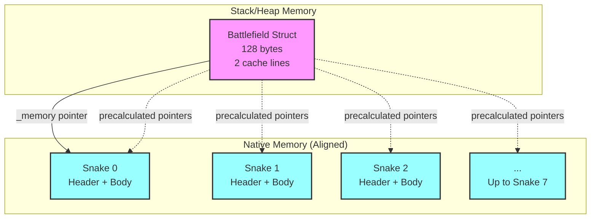
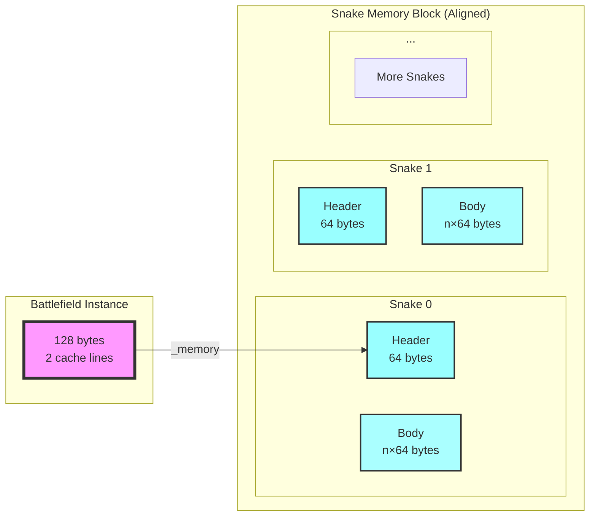
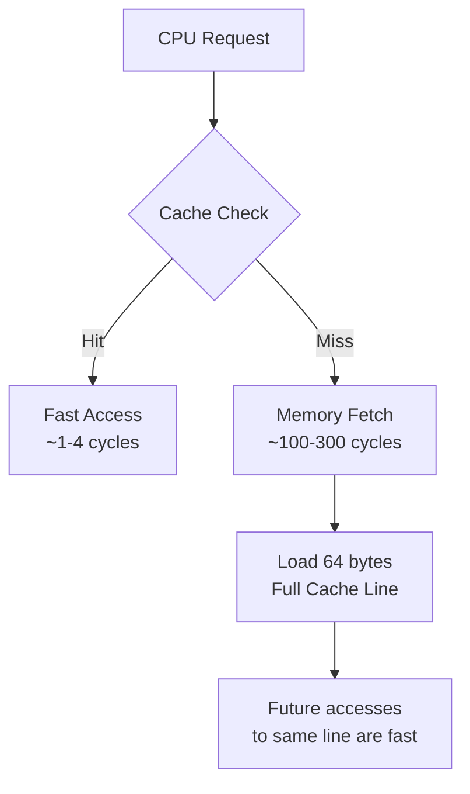
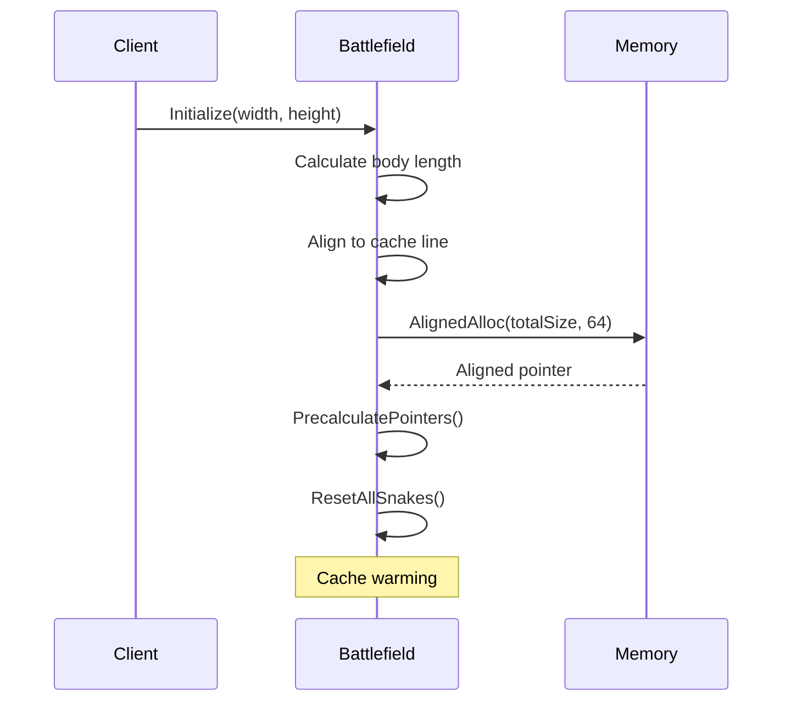
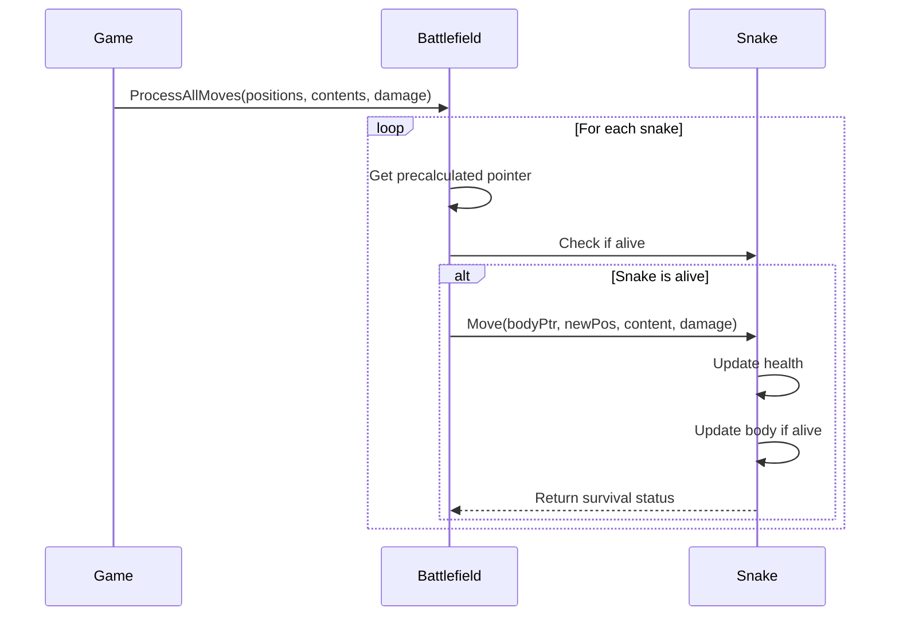
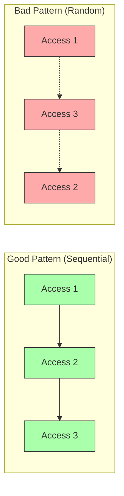

# BattleSnake & Battlefield - Cache-Optimized Memory Architecture

## Overview

This document provides a comprehensive technical analysis of the `BattleSnake` and `Battlefield` structures, which implement a high-performance, cache-optimized memory layout for the Battlesnake game engine. The architecture demonstrates advanced memory management techniques including cache line alignment, false sharing prevention, and optimal data locality.

## Table of Contents

1. [Architecture Overview](#architecture-overview)
2. [BattleSnake Structure](#battlesnake-structure)
3. [Battlefield Structure](#battlefield-structure)
4. [Memory Layout](#memory-layout)
5. [Performance Optimizations](#performance-optimizations)
6. [Implementation Details](#implementation-details)
7. [Cache Performance Analysis](#cache-performance-analysis)

## Architecture Overview

The system implements a two-tier memory architecture:



### Key Design Principles

1. **Cache Line Alignment**: All major data structures are aligned to 64-byte boundaries
2. **Data Locality**: Related data is grouped within the same cache line
3. **False Sharing Prevention**: Independent data structures occupy separate cache lines
4. **Memory Access Patterns**: Sequential and predictable access patterns for optimal prefetching

## BattleSnake Structure

### Memory Layout

```mermaid
graph LR
    subgraph "Cache Line 1 (0-63 bytes)"
        H1[Health<br/>4 bytes]
        H2[Length<br/>4 bytes]
        H3[MaxLength<br/>4 bytes]
        H4[Head<br/>2 bytes]
        H5[Padding<br/>50 bytes]
    end
    
    subgraph "Cache Line 2+ (64+ bytes)"
        B1[Body[0]<br/>2 bytes]
        B2[Body[1]<br/>2 bytes]
        B3[Body[2]<br/>2 bytes]
        BN[...<br/>Body[n]]
    end
    
    H1 --> H2 --> H3 --> H4 --> H5
    B1 --> B2 --> B3 --> BN
    
    style H1 fill:#faa,stroke:#333
    style H2 fill:#faa,stroke:#333
    style H3 fill:#faa,stroke:#333
    style H4 fill:#faa,stroke:#333
    style H5 fill:#ddd,stroke:#333
```

### Structure Definition

```csharp
[StructLayout(LayoutKind.Sequential, Pack = 1)]
public unsafe struct BattleSnake
{
    public const int HeaderSize = 64; // Exactly one cache line

    // === CACHE LINE 1 - HEADER (64 bytes) ===
    public int Health;      // 4 bytes - offset 0
    public int Length;      // 4 bytes - offset 4
    public int MaxLength;   // 4 bytes - offset 8
    public ushort Head;     // 2 bytes - offset 12
    private fixed byte _padding[50]; // 50 bytes - offset 14-63
    
    // === CACHE LINE 2+ - BODY ARRAY ===
    public fixed ushort Body[1]; // Variable size, starts at offset 64
}
```

### Key Features

- **Header Isolation**: All frequently accessed metadata fits within a single cache line
- **Body Alignment**: The body array starts exactly at a cache line boundary
- **Explicit Padding**: Ensures predictable memory layout across different platforms
- **Pack = 1**: Prevents compiler from adding implicit padding

## Battlefield Structure

### Memory Layout

```mermaid
graph TB
    subgraph "Cache Line 1 (0-63 bytes)"
        direction LR
        F1[_boardWidth<br/>4 bytes]
        F2[_boardHeight<br/>4 bytes]
        F3[_maxBodyLength<br/>4 bytes]
        F4[_snakeStride<br/>4 bytes]
        F5[_totalMemory<br/>8 bytes]
        F6[_memory<br/>8 bytes]
        F7[_isInitialized<br/>1 byte]
        F8[padding<br/>31 bytes]
    end
    
    subgraph "Cache Line 2 (64-127 bytes)"
        P[_snakePointers[8]<br/>64 bytes total<br/>8 pointers × 8 bytes each]
    end
    
    F1 --> F2 --> F3 --> F4 --> F5 --> F6 --> F7 --> F8
```

### Structure Definition

```csharp
[StructLayout(LayoutKind.Sequential, Pack = 8)]
public unsafe struct Battlefield : IDisposable
{
    // Constants
    private const int MaxSnakes = 8;
    private const int CacheLine = 64;
    private const int SnakeElementsPerCacheLine = 32; // 64 bytes / 2 bytes per ushort

    // === FIRST CACHE LINE (0-63 bytes) ===
    private int _boardWidth;      // 4 bytes
    private int _boardHeight;     // 4 bytes
    private int _maxBodyLength;   // 4 bytes
    private int _snakeStride;     // 4 bytes
    private nuint _totalMemory;   // 8 bytes
    private byte* _memory;        // 8 bytes
    private bool _isInitialized;  // 1 byte
    private fixed byte _padding[31]; // 31 bytes
    
    // === SECOND CACHE LINE (64-127 bytes) ===
    private fixed long _snakePointers[MaxSnakes]; // 64 bytes
}
```

### Key Features

- **Configuration Grouping**: Board configuration and memory management fields share a cache line
- **Pointer Array Isolation**: Snake pointers occupy their own cache line for efficient iteration
- **Precalculated Pointers**: Eliminates runtime multiplication during snake access
- **Aligned Allocation**: Uses `NativeMemory.AlignedAlloc` for cache-aligned memory

## Memory Layout

### Overall Memory Organization



### Memory Allocation Strategy

1. **Battlefield Structure**: Lives on the stack or as part of a heap object
2. **Snake Memory Block**: Allocated as a single contiguous block using `NativeMemory.AlignedAlloc`
3. **Snake Stride**: Each snake occupies `HeaderSize + (MaxBodyLength × sizeof(ushort))` bytes
4. **Alignment Guarantee**: Every snake starts on a 64-byte cache line boundary

### Address Calculation

```csharp
// Snake address calculation
SnakeAddress = _memory + (index × _snakeStride)

// Body pointer calculation
BodyPointer = SnakeAddress + HeaderSize

// Both are guaranteed to be cache-line aligned
```

## Performance Optimizations

### 1. Cache Line Optimization



### 2. False Sharing Prevention

Each snake occupies its own set of cache lines, preventing false sharing:

```
Snake 0: Cache lines 0-n
Snake 1: Cache lines (n+1)-(2n+1)
Snake 2: Cache lines (2n+2)-(3n+2)
...
```

### 3. Sequential Access Patterns

The `ProcessAllMoves` method accesses snakes sequentially:

```csharp
for (var i = 0; i < MaxSnakes; i++)
{
    var snakePtr = (BattleSnake*)_snakePointers[i];
    // Sequential access pattern enables hardware prefetching
}
```

### 4. Branch Prediction Optimization

The `Move` method orders switch cases by frequency:

```csharp
switch (content)
{
    case CellContent.Empty:      // Most common
    case CellContent.Food:       // Less common
    case CellContent.Hazard:     // Rare
    case CellContent.EnemySnake: // Instant death
}
```

## Implementation Details

### Initialization Flow



### Move Processing Flow



## Cache Performance Analysis

### Cache Hit Rates

Based on the optimized layout:

| Operation | Expected Cache Hit Rate | Rationale |
|-----------|------------------------|-----------|
| Snake header access | ~95%+ | All header fields in one line |
| Body array access | ~90%+ | Sequential access pattern |
| Pointer array iteration | ~98%+ | Single cache line for all pointers |
| Cross-snake access | ~0% | Different cache lines (by design) |

### Memory Access Patterns



### Performance Metrics

- **Cache Line Utilization**: Near 100% for header data
- **False Sharing**: Eliminated through alignment
- **Memory Bandwidth**: Optimized through sequential access
- **Branch Misprediction**: Minimized through frequency ordering

## Best Practices Demonstrated

1. **Explicit Memory Layout**: Using `StructLayout` and explicit padding
2. **Aligned Allocation**: Using `NativeMemory.AlignedAlloc` for cache alignment
3. **Pointer Precalculation**: Avoiding runtime arithmetic
4. **Early Exit Optimization**: Skipping memory operations for dead snakes
5. **Cache Warming**: Touching memory during initialization
6. **Sequential Access**: Processing snakes in order for prefetching

## Conclusion

The `BattleSnake` and `Battlefield` implementation represents a masterclass in cache-aware programming. The architecture achieves:

- **Predictable Performance**: Consistent memory access times
- **Minimal Cache Misses**: Through careful data organization
- **Optimal Memory Bandwidth**: Via sequential access patterns
- **Zero False Sharing**: Through cache line isolation

This design ensures that the game engine can process thousands of snake movements per second with minimal CPU stalls, making it suitable for high-performance game scenarios.